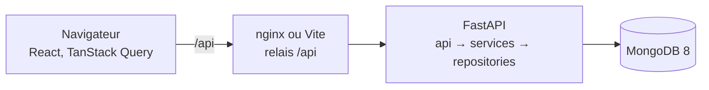

# Architecture

## Vue d'ensemble

Le navigateur ne connaît qu'une seule origine : le serveur qui lui a servi la page. Les appels partent vers `/api`, que ce serveur relaie vers le backend. Il n'y a donc **ni CORS ni URL d'API dans le code du front**, et la même image fonctionne dans les trois environnements.

| Conteneur | Développement | Production |
|---|---|---|
| `frontend` | Vite, rechargement à chaud, relais `/api` par son `proxy` | nginx, fichiers statiques compressés, relais `/api` par `proxy_pass` |
| `backend` | uvicorn, port publié sur `127.0.0.1` pour interroger l'API sans passer par le front | uvicorn, image figée, utilisateur non root |
| `mongo` | MongoDB 8, cache fixé à 1 Go, volume nommé, port publié sur `127.0.0.1` pour `mongosh` | identique : le port reste lié à la boucle locale, jamais exposé au réseau |

Un seul `docker-compose.yml`, et un fichier `.env.{dev,preprod,prod}` par environnement : les cibles de build, les ports publiés et le niveau de log en sortent. Le backend attend que MongoDB réponde (`depends_on` avec `condition: service_healthy`) avant de démarrer.

## Le trajet d'une requête

1. **`app/api/`** — la route lit et valide les paramètres, puis appelle un service. Elle ne contient aucune règle métier, et ne connaît ni MongoDB ni PyMongo. `app/main.py` traduit les erreurs métier en codes HTTP.
2. **`app/services/`** — les règles : quels types une colonne accepte, comment lire un fichier, ce qu'un filtre a le droit de demander, ce qu'une conversion casse.
3. **`app/repositories/`** — la seule couche qui parle à MongoDB : requêtes, agrégations, index, et traduction des erreurs PyMongo en erreurs métier.

Aucune couche n'appelle celle du dessus. `app/schemas/` traverse les trois : ce sont les contrats Pydantic échangés avec le front.

**Il n'y a pas de couche `models/`.** Les documents d'un import n'ont pas de schéma fixe : leurs champs sont les colonnes du fichier envoyé, et changent à chaque import. Les seules entités qui ont un schéma stable, l'import et le traitement en cours, sont déjà décrites par `schemas/`. Une couche supplémentaire n'aurait fait que recopier ces classes, et il aurait fallu la maintenir.

## Backend, fichier par fichier

| Fichier | Rôle |
|---|---|
| `api/imports.py` | CRUD des imports, envoi de fichier, types des colonnes, lecture et écriture des données, statistiques. |
| `api/jobs.py` | Suivi d'un traitement en arrière-plan. |
| `api/health.py` | État du service et de la base, utilisé par Docker et par la CI. |
| `services/imports.py` | Position dans la liste, ordre complet, import introuvable. |
| `services/file_reader.py` | Ouverture d'un CSV ou d'un XLSX, en-têtes, lecture par blocs, détection de l'encodage. |
| `services/type_detection.py` | Types encore possibles pour une colonne, d'après **toutes** les valeurs lues. |
| `services/conversion.py` | Transformation d'un bloc de lignes texte en documents typés. |
| `services/uploads.py` | Import en arrière-plan : lecture, insertion par lots, bascule de version. |
| `services/columns.py` | Clés MongoDB uniques à partir des en-têtes, et normalisation sans accents. |
| `services/column_types.py` | Correction du type d'une colonne : vérification d'abord, conversion ensuite. |
| `services/data.py` | Construction du filtre et du tri depuis l'URL, lecture des valeurs saisies, écritures unitaires et par lot. |
| `services/stats.py` | Chiffres d'une colonne et tableau des occurrences, avec les trois filtres possibles. |
| `repositories/imports.py` | Collection `imports` : CRUD, unicité du nom, ordre, suppression des collections liées. |
| `repositories/import_data.py` | Collections de données : insertion par lots, versions, index, lecture, écritures, agrégations. |
| `repositories/jobs.py` | Collection `jobs` : création, avancement, fin. |
| `core/config.py` | Réglages lus dans l'environnement. |
| `core/database.py` | Client `AsyncMongoClient`, index de démarrage, cycle de vie. |
| `core/errors.py` | Erreurs métier, dont `FieldErrors` qui porte un message par champ refusé. |
| `core/uploads.py` | Copie d'un fichier reçu sur le disque, et sa suppression garantie. |

## Collections MongoDB

| Collection | Contenu |
|---|---|
| `imports` | Un document par import : nom, position, état, version en place, colonnes typées, nombre de lignes, job en cours, dernière erreur. |
| `import_data_{id}_v{n}` | Les lignes d'une **version** des données d'un import, une par document, `_id` égal au rang de la ligne dans le fichier, à partir de 0. |
| `jobs` | Suivi des traitements en arrière-plan : état, lignes traitées sur le total, message d'erreur. |

Une colonne de texte est écrite deux fois : sa valeur, et une copie `_n_{clé}` en minuscules sans accents, qui sert au filtre « contient ». Les copies ne sortent jamais de l'API.

## Frontend

| Dossier | Rôle |
|---|---|
| `src/pages/` | Un composant par route : `HomePage` (liste des imports), `ImportPage` (onglets Colonnes, Données, Statistiques). |
| `src/components/` | Interface : `AppShell` (barre latérale et fil d'Ariane), `DataTable` (tableau virtualisé), `StatsPanel`, `FileImport`, `RowEditor`, `BatchEditor`, `Pagination`, `ConfirmDialog`. |
| `src/hooks/` | `useImports` (requêtes, mutations, invalidation) et `useTableState` (état du tableau ↔ URL). |
| `src/services/` | Client HTTP et appels à l'API, y compris la construction des URL de filtre. |
| `src/types/` | Contrats TypeScript alignés sur les schémas du backend. |
| `src/theme/` | Tokens de la charte et constantes d'affichage partagées. |
| `tests/` | Tests des services, des composants et des écrans. |

Aucun état serveur n'est copié dans un état React : TanStack Query est la seule source. L'état de la vue, lui, vit dans l'URL (`useTableState`), pas dans un composant, pour qu'un rechargement ou un lien partagé redonne la même page.

## Règles du CRUD des imports

- **Noms uniques, insensibles à la casse et aux accents.** L'index unique sur `name` porte la collation `{locale: "fr", strength: 2}` : « Clients » et « clients » sont le même nom. C'est MongoDB qui refuse le doublon, pas une vérification préalable, donc deux créations simultanées ne peuvent pas passer toutes les deux.
- **Aucune erreur MongoDB ne sort du repository.** `DuplicateKeyError` y devient `ConflictError`. `app/main.py` traduit ensuite chaque erreur métier en code HTTP : `NotFoundError` 404, `ConflictError` 409, `InvalidError` 422. Aucune route ne manipule d'exception PyMongo.
- **Un identifiant mal formé n'est pas une erreur serveur.** S'il ne peut pas être un `ObjectId`, le repository répond « absent » : 404, et non 500.
- **L'ordre est enregistré en un seul aller-retour.** `set_order` envoie toutes les positions dans un `bulk_write`, et la liste est relue triée sur `(order, _id)`.
- **Les dates sortent en UTC avec leur fuseau.** Elles sont écrites par `datetime.now(UTC)` et relues avec `tz_aware=True` : sans ce drapeau PyMongo les rend naïves, et le navigateur affiche l'heure UTC comme si elle était locale.
- **Supprimer un import supprime ses données.** Toutes ses collections `import_data_{id}_v…` sont retirées dans la foulée, quelle que soit la version : aucune collection orpheline.
